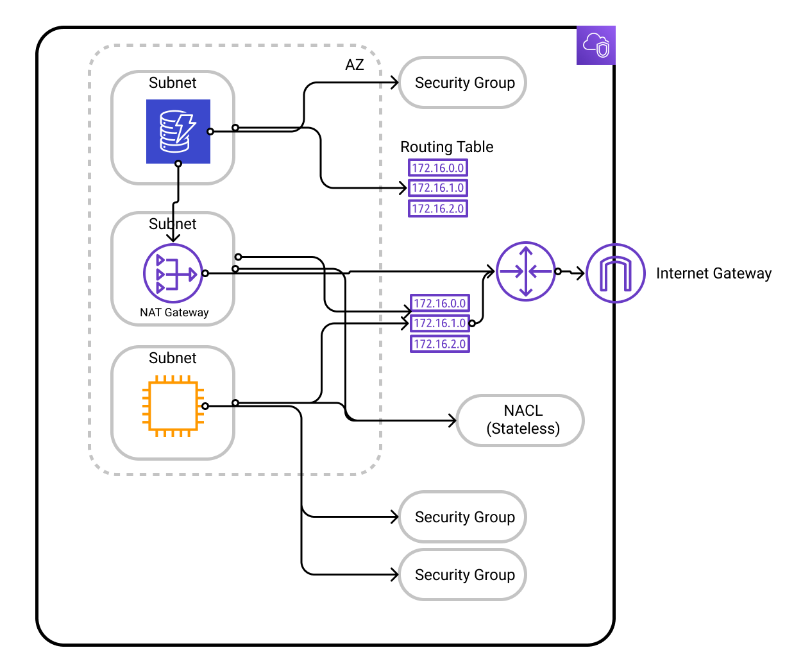

<!-- @format -->

# EC2

## Rough Architecture of components in a VPC

## Useful Links

-  [Guide/Concepts](https://docs.aws.amazon.com/AWSEC2/latest/UserGuide/concepts.html)
-  [Using EC2 with CLI](https://docs.aws.amazon.com/cli/latest/userguide/cli-services-ec2.html)
-  [Reference v3](https://docs.aws.amazon.com/AWSJavaScriptSDK/v3/latest/clients/client-ec2/index.html)
-  [EC2 Reference](https://docs.aws.amazon.com/AWSJavaScriptSDK/latest/AWS/EC2.html)
-  [EC2 Instance Connect](https://docs.aws.amazon.com/AWSEC2/latest/UserGuide/ec2-instance-connect-set-up.html)
-  [IAM Roles Guide](https://docs.aws.amazon.com/IAM/latest/UserGuide/id_roles.html)
-  [IAM Reference](https://docs.aws.amazon.com/AWSJavaScriptSDK/latest/AWS/IAM.html)
-  [Role vs Instance Profile](https://medium.com/devops-dudes/the-difference-between-an-aws-role-and-an-instance-profile-ae81abd700d)
-  [Bootstrap Scripts](https://docs.aws.amazon.com/AWSEC2/latest/UserGuide/user-data.html)
-  [Instance Metadata](https://docs.aws.amazon.com/AWSEC2/latest/UserGuide/ec2-instance-metadata.html)
-  [CIDR Visualizer](https://cidr.xyz/)
