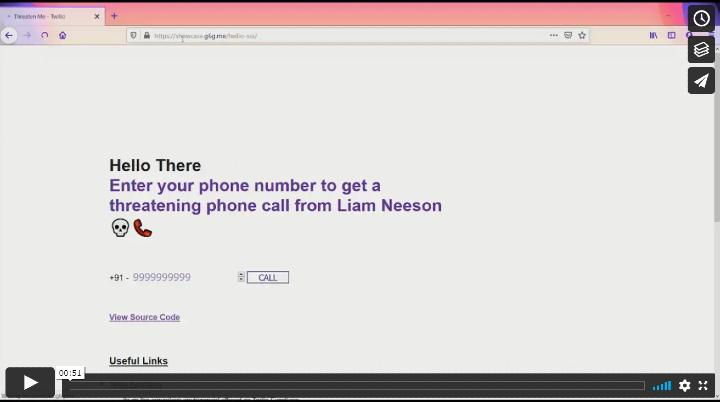

<!-- @format -->

# Twilio Special Set Of Skills

Get a threatening phone call from Liam Neeson. Uses Twilio Voice and Twilio Functions.

Watch a quick video demo:

[](https://vimeo.com/493899741 'Video Demo - Click to Watch!')

A deployed showcase can be [accessed here](https://showcase.g6g.me/twilio-sss/) (Note: This uses a trial account, and will therefore only work with verified phone numbers).

# Setup

## Backend using Twilio Functions

A [UI-only function](https://www.twilio.com/docs/runtime/functions) is used given the simple functionality

-  Setup a twilio account and phone number using [this guide](https://www.twilio.com/docs/usage/tutorials/how-to-use-your-free-trial-account)
-  Create a serverless service using [this guide](https://www.twilio.com/docs/runtime/functions/create-service)
-  Upload `twilio/threaten.mp3` as an asset to Twilio
-  Update URL generated for the mp3 file in `twilio/call.xml` and upload the XML file as an asset to Twilio
-  Create an environment variable called `TWIML_URL` in your service, with its value being the URL of the uploaded XML file
-  CREATE an environment variable `FROM` with its value being your twilio phone number
-  Add code from `twilio/serverless-call.js` as a function in your service and note down its endpoint
-  Deploy the service

## Frontend using Gatsby

-  Supply the function endpoint as an environment variable `FUNCTION_ENDPOINT` to your Gatsby site

### Running Locally

```
npm install
npm start
```

The site will be available on http://localhost:8000/

### Deploying

```
npm run build
```

The generated `public` folder can be hosted as a static site

# Useful Links

-  https://www.twilio.com/docs/runtime/functions
-  https://www.twilio.com/docs/runtime/quickstart/serverless-functions-make-a-call
-  https://www.twilio.com/docs/runtime/functions/invocation#constructing-a-response
-  https://www.twilio.com/docs/glossary/what-is-twilio-markup-language-twiml
-  https://www.twilio.com/docs/voice/quickstart/node
-  https://www.twilio.com/docs/runtime/functions/create-service
-  https://www.twilio.com/docs/usage/tutorials/how-to-use-your-free-trial-account
-  https://www.gatsbyjs.com/docs/how-to/previews-deploys-hosting/path-prefix/
