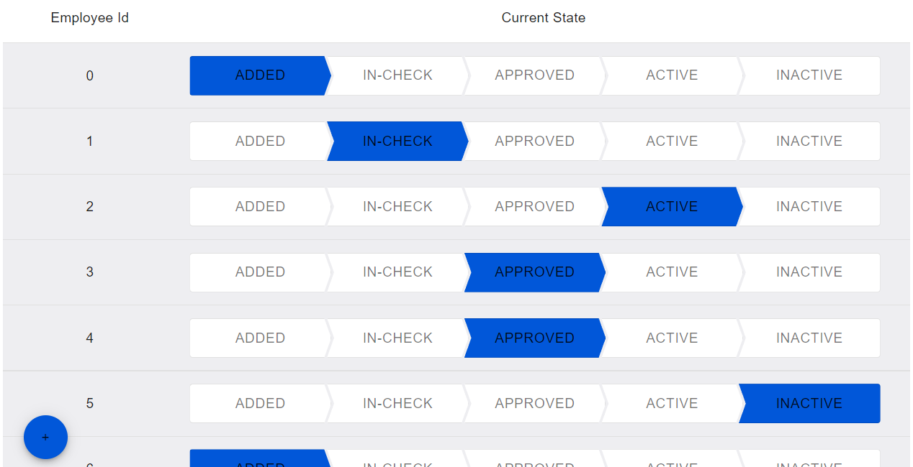

<!-- @format -->

# Employee Management

A simple employee management system built using React (Typescript)



## Setup

### Clone The Repo

[How to clone a repo](https://docs.github.com/en/repositories/creating-and-managing-repositories/cloning-a-repository)

### Install Dependencies

```
npm install
```

### Run the App

```
npm start
```

(This will start the mock server on port 4000 and the react app on port 3000)

Go to http://localhost:3000/

### Running Tests

```
npm test
```

## Project Structure

### React App

The main React app is built using [Next.js](https://nextjs.org/) as a framework.
There is a single home page inside `pages` directory.

All of the signicant code and test files are inside the `components` directory.

### Mock Server

A simple node/express server is present - running from inside the `mock-server` directory.
(This uses memory to store an initial list of employees. All changes made by the user are persisted in memory. This means that the changes will be lost if the server is shut down or restarted).

## Functionality

1. View initial list of employees and their current state
1. Click on a state for any employee to change their state
1. Click on the Plus button to add a new employee
