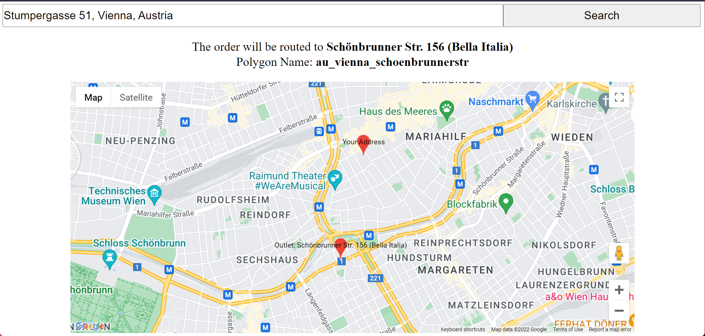

<!-- @format -->

# Find Delivery Outlet

A full-stack MVP to find the correct delivery outlet based on input location and predefined delivery area polygons.



## Setup

Given the limited scope, the project is setup as a monorepo.
The folder `api` contains the server end api code - built using Nodejs.
The folder `app` contains the front-end code - built using [NextJs](https://nextjs.org/) as a framework.

The top-level package json will allow you to setup both components.

### To install dependencies, run:

```
npm install
```

### Env Variables

Edit the file `app/.env.local` and add a key needed to call the Maps API.

### Then, to run the application,

```
npm start
```

This will start the frontend app on http://localhost:3000/ with the api server running on http://localhost:4000

### Using the application

Try to search for the following places (Select an option from the Autocomplete dropdown and then click search):

#### These should return a valid polygon and outlet

-  Stumpergasse 51
-  Ungargasse 17
-  Linzer Straße 7
-  Maurer Hauptplatz 7

#### These should return a message saying that the loaction is not currently served

-  Bahnhofplatz 1, Linz
-  Quadenstraße 5

## Running tests

Tests are setup using Jest

```
npm test
```

## Basic Flow

The front end allows the user to search for their location using [Google Maps Places Autocomplete](https://developers.google.com/maps/documentation/javascript/places-autocomplete?hl=en_US)

The latitute, longitude information is sent to the server.

The server checks if these coordinates fall inside any of our polygons using turfjs [booleanPointInPolygon](http://turfjs.org/docs/#booleanPointInPolygon).
(A brute force approach is very perfomant given the small set of polygons. For a bigger dataset, a library like rbush can be considered).
We return information about the polygon and the delivery outlet corresponding to the polygon. This is displayed to the user, with a visualization using the [Google Maps JS API](https://developers.google.com/maps/documentation/javascript?hl=en_US)

## Further improvements

-  There is scope to improve the overall tooling of the project.

### App

-  Testing is currently not comprehensive (This will require proper mocking of the google maps library)
-  Loading states and error handling have scope for improvement
-  Google Maps API key needs to be protected better

## API

-  Routes and functions do not include proper validations, security checks

# Useful Links

-  [Turf.js](http://turfjs.org/)
-  [Google Earth](https://earth.google.com/web)
-  [ToGeoJson](https://github.com/mapbox/togeojson)
-  [Google Maps Places Autocomplete](https://developers.google.com/maps/documentation/places/web-service/autocomplete)
-  [KML](https://developers.google.com/kml/documentation)
-  [NextJs](https://nextjs.org/)
-  [Google Maps JS API](https://developers.google.com/maps/documentation/javascript?hl=en_US)
